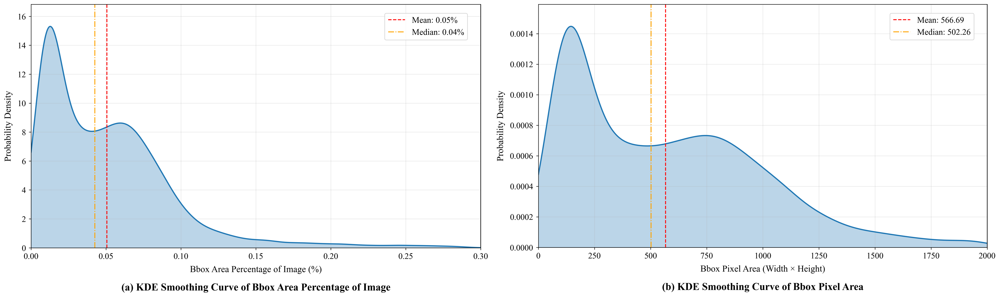
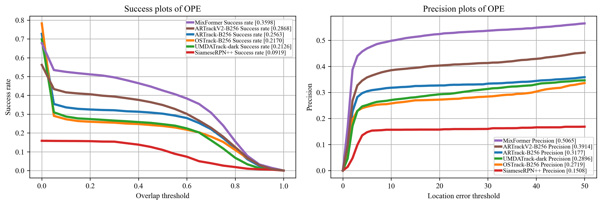
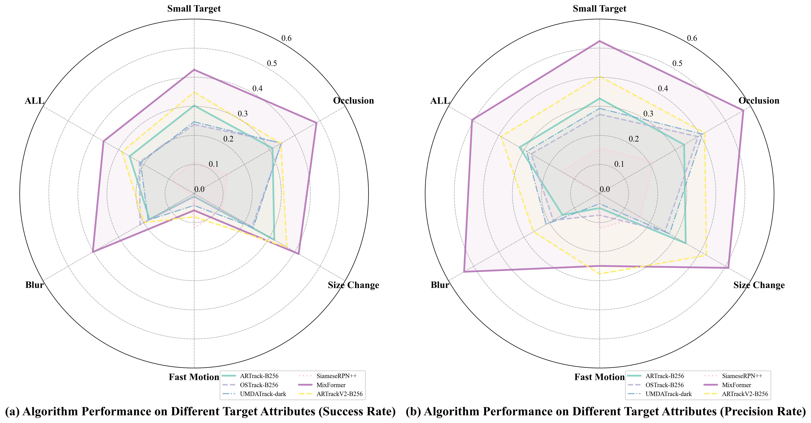

# BirdSOTB: A Benchmark for Bird Single Object Tracking to Support Navigation Services

BirdSOTB is a specialized benchmark dataset designed for **Single Bird Object Tracking**, aimed at supporting aviation safety, ecological monitoring, and autonomous navigation services.

## Project Overview

Visual object tracking of birds faces unique challenges such as high-speed maneuvers, extremely small target sizes, frequent occlusions, and motion blur. BirdSOTB provides a high-quality, manually annotated dataset to support specialized bird tracking research.

### Key Features

- **Specialized Dataset**: 14 video sequences with 5,489 frames, specifically focusing on bird targets.
- **Diverse Challenges**: Covers Fast Movement (FM), Small Target (ST), Occlusion (POC/FOC), Out-of-View (OV), and Motion Blur (MB).
- **Quantitative Evaluation**: A rigorous quantitative attribute evaluation system based on multiple metrics (Scale Ratio, Area Ratio, Normalized Speed, etc.).

## Quantitative Comparison

<table>
  <thead>
    <tr>
      <th rowspan="2">Dataset</th>
      <th colspan="8">Average Attribute</th>
    </tr>
    <tr>
      <th>SR</th>
      <th>ST-Tiny</th>
      <th>ST-Small</th>
      <th>FM</th>
      <th>MB</th>
      <th>CT</th>
      <th>SC</th>
      <th>FOC/OV</th>
    </tr>
  </thead>
  <tbody>
    <tr>
      <td>LaSOT-Test</td>
      <td>0.2040</td>
      <td>0.17%</td>
      <td>29.27%</td>
      <td>0.04%</td>
      <td>17.02%</td>
      <td>0.1122</td>
      <td><b>593.35</b></td>
      <td>1.24%</td>
    </tr>
    <tr>
      <td>DTB70</td>
      <td>0.0634</td>
      <td>0</td>
      <td>89.29%</td>
      <td>0.01%</td>
      <td>3.23%</td>
      <td>0.1012</td>
      <td>10.17</td>
      <td>0.28%</td>
    </tr>
    <tr>
      <td>UAVDT-SOT</td>
      <td>0.0571</td>
      <td>0.32%</td>
      <td>85.13%</td>
      <td>0.03%</td>
      <td>1.04%</td>
      <td><b>0.1706</b></td>
      <td>26.05</td>
      <td>0</td>
    </tr>
    <tr>
      <td>UAV123</td>
      <td>0.0658</td>
      <td>1.08%</td>
      <td>81.02%</td>
      <td>0.02%</td>
      <td>2.92%</td>
      <td>0.1046</td>
      <td>79.01</td>
      <td>2.21%</td>
    </tr>
    <tr>
      <td>UAV2UAV</td>
      <td>0.0647</td>
      <td>0.79%</td>
      <td>79.95%</td>
      <td>0</td>
      <td>2.97%</td>
      <td>0.0840</td>
      <td>20.42</td>
      <td>0</td>
    </tr>
    <tr>
      <td><b>BirdSOTB (ours)</b></td>
      <td><b>0.0195</b></td>
      <td><b>12.02%</b></td>
      <td><b>100%</b></td>
      <td><b>4.29%</b></td>
      <td><b>45.29%</b></td>
      <td>0.0136</td>
      <td>24.04</td>
      <td><b>11.96%</b></td>
    </tr>
  </tbody>
</table>

## Data Examples

*Fig 1. Example data from BirdSOTB showing target pixel-level dimensions and motion/size changes.*

*Fig 2. Distribution analysis of bounding box area (Percentage and Pixel) via KDE.*

## Tracking Performance Evaluation

*Fig 4. OPE evaluation results, including success rate and precision rate.*

*Fig 5. Track algorithm performance evaluation results on core attributes.*

## Qualitative Evaluation

*Fig 3. Qualitative evaluation of challenging sequences in the BirdSOTB dataset.*

## Availability

- **Dataset**: Coming soon.

---
© 2026 BirdSOTB Team. All rights reserved.
